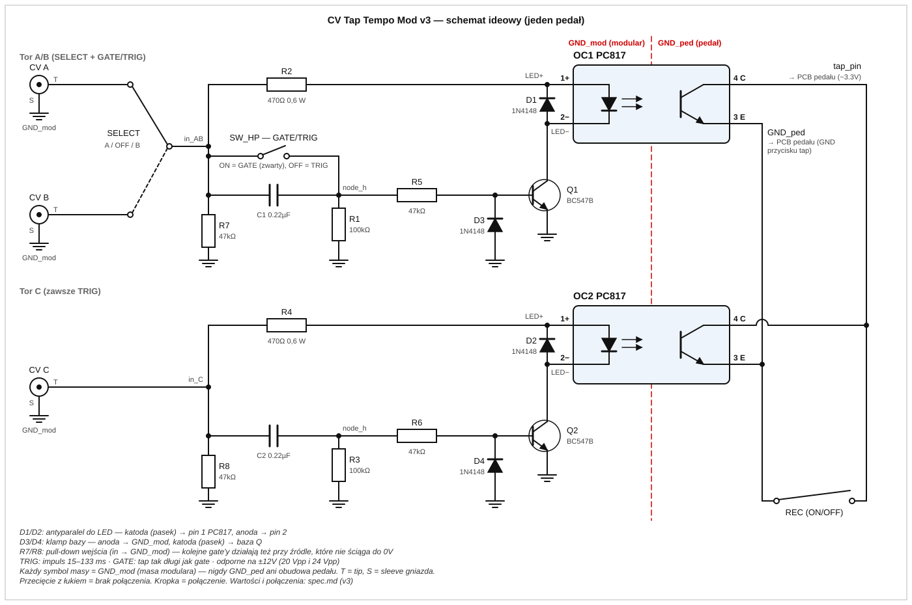

# CV Tap Tempo Mod — EHX SMMH + Cathedral

Modyfikacja sprzętowa dodająca wejścia CV trigger/gate z Eurorack do funkcji tap tempo w pedałach:

- **EHX Stereo Memory Man with Hazarai** (delay)
- **EHX Cathedral** (reverb)

Projekt oparty na modyfikacji [navs.modular.lab](http://navsmodularlab.blogspot.com/2009/08/more-hazarai-ehx-smmh-modification.html).

---

## Co robi ten mod

Każdy pedał otrzymuje trzy wejścia CV 3.5mm (standard Eurorack 0–5V):

| Wejście | Opis |
|---|---|
| **A** | Trigger/gate, przełączane przez SELECT |
| **B** | Trigger/gate, przełączane przez SELECT |
| **C** | Zawsze aktywne, zawsze z filtrem HP |

Oraz trzy przełączniki:

| Przełącznik | Funkcja |
|---|---|
| **SELECT** (ON/OFF/ON) | Wybór aktywnego wejścia: A / wyłączone / B |
| **HP** (ON/OFF) | Filtr górnoprzepustowy dla toru A/B (blokuje DC i long gates) |
| **REC** (ON/OFF) | Przytrzymanie tap — wejście w tryb loopera (SMMH) |

---

## Schemat ideowy



## Zasada działania

Przycisk tap w obu pedałach to pin MCU trzymany na ~3.3V, zwarcie do GND = wciśnięcie. Obwód używa optoizolatorów PC817 do symulowania tego zwarcia z pełną izolacją galwaniczną — GND modulara i GND pedału są oddzielone, co eliminuje ryzyko pętli masy i humu. Filtr HP (RC: 0.1µF + 10kΩ, f_c ≈ 160 Hz, τ ≈ 1ms) skraca długie gate'y do krótkich impulsów, zapobiegając przypadkowemu wejściu pedału w tryb loopera.

```
CV ──[0.1µF]──┬──[470Ω]──[D: 1N4148 ⟂]──LED(+)[PC817]LED(−)──GND_modular
             [10kΩ]                         fototranzystor C ──── tap_pin pedału
              │                             fototranzystor E ──── GND_pedału
             GND_modular
```

Dioda 1N4148 (antyparalel do LED) chroni diodę LED przed ujemnym spikiem generowanym przez kondensator filtra HP przy opadającym zboczu gate'a.

---

## Komponenty (na jeden pedał)

| Element | Wartość | Ilość |
|---|---|---|
| Optoizolator | PC817 (DIP-4) | 2 |
| Dioda małosygnałowa | 1N4148 | 2 |
| Rezystor | 10kΩ, 1/4W | 2 |
| Rezystor | 470Ω, 1/4W | 2 |
| Kondensator filmowy | 0.1µF (WIMA MKS2 lub ekw.) | 2 |
| Toggle switch 3-poz | ON/OFF/ON, SPDT, mini | 1 |
| Toggle switch 2-poz | ON/OFF, SPST, mini | 2 |
| Gniazdo 3.5mm | Thonkiconn PJ398SM lub Cliff FC68131 | 3 |
| Perfboard | ~4×5 cm, raster 2.54mm | 1 |

---

## Pliki

- [`spec.md`](spec.md) — pełna specyfikacja projektu (projekt obwodu, logika przełączania, weryfikacja elektryczna)
- [`plan.md`](plan.md) — plan implementacji krok po kroku (BOM, layout perfboard, montaż, testy)

---

## Znane ograniczenia

- **Cathedral:** podczas tapowania reverb krótko się urywa — ograniczenie firmware, nie moda

---

## Źródła

- [navs.modular.lab — More Hazarai!](http://navsmodularlab.blogspot.com/2009/08/more-hazarai-ehx-smmh-modification.html)
- [navs.modular.lab — Even More Hazarai!](http://navsmodularlab.blogspot.com/2011/10/even-more-hazarai.html)
- [GitHub: x37v/ehx-hazarai (KiCad)](https://github.com/x37v/ehx-hazarai)
- [How to Add Voltage Control to an EHX Cathedral](https://donotfuckup.home.blog/2019/03/09/how-to-add-voltage-control-to-an-ehx-cathedral/)
- [EHX Cathedral CV mod — MOD WIGGLER](https://modwiggler.com/forum/viewtopic.php?t=60110)
